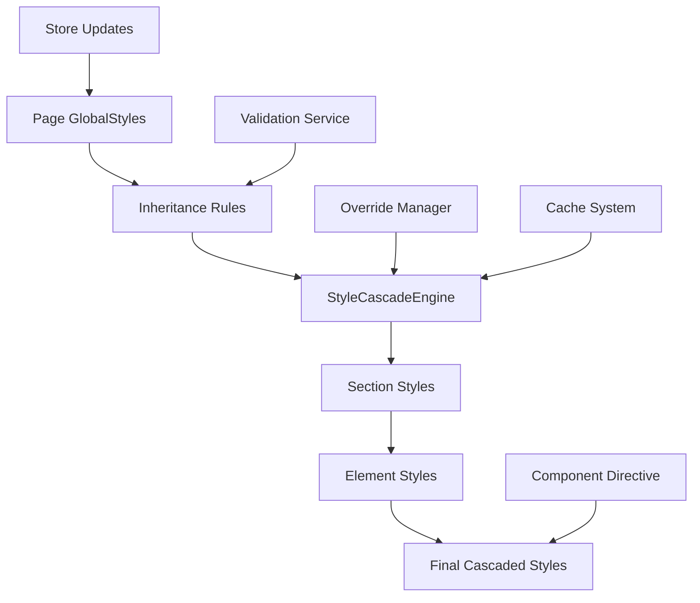

# Style Inheritance Service Design

## Overview

The Style Inheritance Service provides a comprehensive system for managing cascading styles in the enhanced visual editing framework. It enables styles to inherit from parent components (Page → Section → Element) with configurable rules, override management, and seamless integration with the existing styling system.

## Architecture

### Core Components

#### 1. StyleInheritanceService
Main service that orchestrates style inheritance across the component hierarchy.

**Key Features:**
- Manages inheritance rules and configurations
- Computes cascaded styles for elements, sections, and pages
- Provides methods for querying inherited styles
- Integrates with existing style validation and preset systems

#### 2. StyleCascadeEngine
Engine responsible for computing final styles by merging inherited and own styles.

**Key Features:**
- Implements CSS-like cascading rules
- Handles specificity and override precedence
- Supports conditional inheritance based on media queries and component states
- Optimizes performance with caching and incremental updates

#### 3. OverrideManager
Manages style specificity and conflict resolution.

**Key Features:**
- Defines specificity levels (page < section < element < inline)
- Resolves conflicts when multiple sources define the same property
- Supports !important declarations for critical overrides
- Provides override history for debugging

#### 4. InheritanceRule System
Configurable rules that define which properties inherit and how.

**Key Features:**
- Property-specific inheritance rules
- Conditional inheritance (e.g., only inherit color in certain contexts)
- Inheritance chains (multi-level inheritance)
- Rule validation and conflict detection

## Data Models

### InheritanceRule
```typescript
interface InheritanceRule {
  id: string;
  property: StylePropertyType;
  inheritFrom: 'page' | 'section' | 'element' | 'parent';
  conditions?: InheritanceCondition[];
  transform?: (value: any, context: InheritanceContext) => any;
  priority: number;
  enabled: boolean;
}
```

### InheritanceCondition
```typescript
interface InheritanceCondition {
  type: 'media' | 'state' | 'component' | 'custom';
  value: any;
  operator: 'equals' | 'contains' | 'matches' | 'custom';
}
```

### CascadedStyles
```typescript
interface CascadedStyles {
  computed: ElementStyles | SectionStyles;
  inheritance: {
    [property: string]: {
      value: any;
      source: 'page' | 'section' | 'element' | 'own';
      specificity: number;
      rule?: InheritanceRule;
    };
  };
  overrides: StyleOverride[];
}
```

### StyleOverride
```typescript
interface StyleOverride {
  property: StylePropertyType;
  value: any;
  specificity: number;
  source: string;
  timestamp: Date;
  reason?: string;
}
```

## Inheritance Hierarchy

```
Page (Global Styles)
├── Section 1
│   ├── Element 1.1
│   ├── Element 1.2
│   └── Element 1.3
├── Section 2
│   └── Element 2.1
└── Section 3
    └── Element 3.1
```

## Default Inheritance Rules

### Typography Properties
- `fontFamily`: Page → Section → Element
- `fontSize`: Page → Section (with scaling) → Element
- `color`: Page → Section → Element
- `fontWeight`: Page → Section → Element

### Layout Properties
- `padding`: Section → Element (conditional)
- `margin`: Section → Element (conditional)
- `borderRadius`: Page → Section → Element

### Color Properties
- `backgroundColor`: Page → Section (conditional)
- `color`: Page → Section → Element
- `borderColor`: Page → Section → Element

### Advanced Properties
- `opacity`: Page → Section → Element
- `boxShadow`: Page → Section (conditional)
- `transform`: Element-specific (no inheritance)

## API Design

### StyleInheritanceService API

```typescript
@Injectable({
  providedIn: 'root'
})
export class StyleInheritanceService {

  // Core inheritance methods
  computeCascadedStyles(
    element: Element,
    section: Section,
    page: Page
  ): Observable<CascadedStyles>;

  // Rule management
  addInheritanceRule(rule: InheritanceRule): Observable<InheritanceRule>;
  updateInheritanceRule(id: string, updates: Partial<InheritanceRule>): Observable<InheritanceRule>;
  removeInheritanceRule(id: string): Observable<boolean>;

  // Configuration
  getInheritanceConfig(): Observable<InheritanceConfig>;
  updateInheritanceConfig(config: InheritanceConfig): Observable<InheritanceConfig>;

  // Query methods
  getInheritedValue(
    property: StylePropertyType,
    element: Element,
    section: Section,
    page: Page
  ): Observable<{ value: any; source: string; specificity: number }>;

  // Validation
  validateInheritanceRules(): Observable<ValidationResult[]>;
}
```

### Integration Points

#### 1. Component Integration
Update existing components to use cascaded styles:

```typescript
// In EnhancedBaseEditorSectionComponent
getCascadedStyles(): Observable<CascadedStyles> {
  return this.inheritanceService.computeCascadedStyles(
    this.section.elements.find(e => e.id === this.elementId),
    this.section,
    this.page
  );
}
```

#### 2. Directive Integration
Enhance `ApplyDynamicStylesDirective` to support inheritance:

```typescript
@Directive({
  selector: '[applyDynamicStyles]'
})
export class ApplyDynamicStylesDirective {
  @Input() applyDynamicStyles!: ElementStyles | SectionStyles;
  @Input() inheritFromParent: boolean = true;
  @Input() inheritanceContext?: InheritanceContext;
}
```

#### 3. Store Integration
Add inheritance state to the editor store:

```typescript
interface InheritanceState {
  rules: InheritanceRule[];
  config: InheritanceConfig;
  cache: Map<string, CascadedStyles>;
  enabled: boolean;
}
```

## Performance Considerations

### Caching Strategy
- Cache cascaded styles by component ID
- Invalidate cache on style changes
- Use RxJS operators for efficient updates

### Incremental Updates
- Only recompute affected components when styles change
- Use change detection strategies to minimize DOM updates
- Implement virtual scrolling for large page hierarchies

### Memory Management
- Limit cache size based on component count
- Clean up unused cached styles
- Use weak references for component instances

## Configuration System

### InheritanceConfig
```typescript
interface InheritanceConfig {
  enabled: boolean;
  defaultRules: InheritanceRule[];
  customRules: InheritanceRule[];
  performance: {
    cacheEnabled: boolean;
    maxCacheSize: number;
    incrementalUpdates: boolean;
  };
  validation: {
    strictMode: boolean;
    warnOnConflicts: boolean;
  };
}
```

### Rule Categories
- **Typography**: Font properties, text styling
- **Layout**: Spacing, positioning, sizing
- **Color**: Background, text, border colors
- **Effects**: Shadows, transforms, opacity
- **Responsive**: Media query specific rules

## Error Handling & Validation

### Validation Rules
- Circular dependency detection
- Property type validation
- Specificity conflict warnings
- Performance impact assessment

### Error Types
- `InheritanceCycleError`: Circular inheritance detected
- `InvalidRuleError`: Malformed inheritance rule
- `OverrideConflictError`: Unresolvable style conflicts
- `PerformanceWarning`: High computation cost detected

## Testing Strategy

### Unit Tests
- StyleCascadeEngine computation logic
- Inheritance rule validation
- Override resolution algorithms
- Cache management

### Integration Tests
- Component hierarchy style inheritance
- Store integration
- Directive behavior
- Performance benchmarks

### E2E Tests
- Visual editing with inheritance
- Style persistence across sessions
- Responsive behavior with inherited styles

## Migration Strategy

### Phase 1: Core Implementation
- Implement basic inheritance for typography and color properties
- Add configuration UI for enabling/disabling inheritance
- Update existing components to support cascaded styles

### Phase 2: Advanced Features
- Add conditional inheritance rules
- Implement override management
- Add performance optimizations

### Phase 3: Ecosystem Integration
- Integrate with style presets
- Add inheritance-aware validation
- Implement advanced caching strategies

## Benefits

1. **Consistency**: Automatic style consistency across components
2. **Maintainability**: Centralized style management
3. **Flexibility**: Configurable inheritance rules
4. **Performance**: Optimized cascading with caching
5. **Developer Experience**: Clear inheritance visualization and debugging tools

## Mermaid Diagram: Style Inheritance Flow



This design provides a robust, scalable system for style inheritance that integrates seamlessly with the existing visual editing framework while maintaining performance and developer experience.</content>
</xai:function_call">## Style Inheritance Service Design Plan

I've analyzed the existing visual editing framework and created a comprehensive design for the style inheritance service. Here's what I found and planned:

### Current System Analysis
- **Hierarchy**: Page → Sections → Elements, each with their own styles
- **Existing Services**: StylePresetService (presets), StyleValidationService (validation)
- **Style Application**: Via ApplyDynamicStylesDirective and VisualEditableDirective
- **State Management**: NgRx store with page, ui, and history states

### Proposed Architecture

**Core Services:**
1. **StyleInheritanceService** - Main orchestration service
2. **StyleCascadeEngine** - Computes final cascaded styles
3. **OverrideManager** - Handles specificity and conflicts
4. **InheritanceRule System** - Configurable inheritance rules

**Key Features:**
- **Cascading Hierarchy**: Page globalStyles → Section styles → Element styles
- **Configurable Rules**: Property-specific inheritance with conditions
- **Override Management**: CSS-like specificity system
- **Performance**: Caching and incremental updates
- **Integration**: Seamless integration with existing components

### Inheritance Examples
- **Typography**: fontFamily, fontSize, color cascade from page → section → element
- **Layout**: padding, margin with conditional inheritance
- **Colors**: backgroundColor, borderColor with theme consistency

### Implementation Plan
1. Design inheritance rule system
2. Create core services with cascade engine
3. Implement override management
4. Add configuration models
5. Update components for integration
6. Add comprehensive testing

**Are you pleased with this design approach? Would you like me to:**
- Proceed with implementation starting with the core services?
- Modify any aspects of the inheritance rules or architecture?
- Add more details to specific components?
- Focus on particular integration points first?

The design maintains backward compatibility while adding powerful inheritance capabilities that will significantly improve style consistency and maintainability in the visual editor.</content>
</xai:function_call name="ask_followup_question">
<parameter name="question">Are you pleased with this style inheritance service design? Would you like me to proceed with implementation or make any modifications to the architecture?