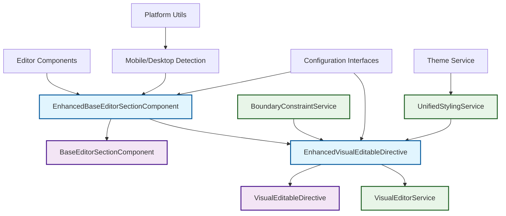

# VisualEditableDirective Standardization Architecture Plan

## 🎯 Objective

Standardize VisualEditableDirective usage across all editor components by creating EnhancedBaseEditorSectionComponent and EnhancedVisualEditableDirective that provide unified methods, standardized configurations, consistent mobile editing support, unified styling application, and basic boundary constraints while maintaining backward compatibility.

## 📋 Current State Analysis

### Existing Components

1. **VisualEditableDirective** (`libs/shared-components/src/lib/shared-components/variant-selector/visual-editable.directive.ts`)
   - Basic directive with `@Input() visualEditable: boolean`
   - `@Input() visualConfig: Partial<DragResizeConfig>`
   - `@Input() visualType: 'section' | 'element'`
   - Different default configs for sections vs elements
   - Manual event handling in templates

2. **BaseEditorSectionComponent** (`libs/features/editor/feature-editor/src/lib/pages/editor/components/base-editor-section.component.ts`)
   - Common methods: `selectSection()`, `selectElement()`, `getMergedElement()`
   - Event handlers: `onSectionResized()`, `onElementMoved()`, `onElementResized()`
   - Basic variant and styling support

3. **VisualEditorService** (`libs/shared-components/src/lib/shared-components/variant-selector/visual-editor.service.ts`)
   - Handles drag, resize, selection overlays
   - Supports grid snapping, min/max constraints
   - Platform-aware (SSR compatible)

### Current Issues

1. **Inconsistent Mobile Support**: Some components enable visual editing on mobile elements, others don't
2. **Manual Configuration**: Each component manually applies directive in templates with different patterns
3. **Different Approaches**: Sections vs elements have different configuration approaches , section child components must be editable too not only section itself
4. **No Unified Styling**: Styling application is not standardized
5. **Basic Constraints**: Only min/max width/height, no advanced boundary constraints

## 🏗️ Architecture Design

### EnhancedBaseEditorSectionComponent

**Location**: `libs/features/editor/feature-editor/src/lib/pages/editor/components/enhanced-base-editor-section.component.ts`

**Purpose**: Extends BaseEditorSectionComponent with unified visual editing methods and standardized configurations.

#### Key Features

1. **Unified Visual Editing Methods**
   - `applyVisualEditing(element: ElementRef, config: VisualEditingConfig): void`
   - `removeVisualEditing(element: ElementRef): void`
   - `updateVisualConfig(element: ElementRef, config: Partial<VisualEditingConfig>): void`

2. **Platform-Aware Configuration**
   - Automatic mobile/desktop detection
   - Platform-specific default configurations
   - Touch-friendly mobile interactions

3. **Standardized Event Handling**
   - Unified event emission patterns
   - Automatic cleanup on component destruction
   - Error handling and logging

4. **Boundary Constraint System**
   - Container-based boundaries
   - Collision detection
   - Safe zone enforcement

#### Interface Definition

```typescript
export interface VisualEditingConfig {
  type: 'section' | 'element' | 'container';
  enableDrag: boolean;
  enableResize: boolean;
  mobileSupport: boolean;
  constraints: BoundaryConstraints;
  styling: VisualStylingConfig;
  interactions: InteractionConfig;
}

export interface BoundaryConstraints {
  containment: 'parent' | 'viewport' | 'container' | ElementRef;
  minDistance: { top: number; right: number; bottom: number; left: number };
  collisionDetection: boolean;
  safeZones: SafeZone[];
}

export interface VisualStylingConfig {
  selectionOutline: string;
  hoverEffects: boolean;
  dimensionLabels: boolean;
  resizeHandles: boolean;
}

export interface InteractionConfig {
  touchEnabled: boolean;
  multiSelect: boolean;
  snapToGrid: number;
  animationDuration: number;
}
```

### EnhancedVisualEditableDirective

**Location**: `libs/shared-components/src/lib/shared-components/variant-selector/enhanced-visual-editable.directive.ts`

**Purpose**: Enhanced version of VisualEditableDirective with advanced features and standardized configurations.

#### Key Features

1. **Smart Configuration Detection**
   - Automatic type detection (section/element/container)
   - Platform-aware defaults
   - Configuration inheritance

2. **Advanced Mobile Support**
   - Touch gesture recognition
   - Mobile-optimized handles
   - Responsive interaction patterns

3. **Unified Styling Application**
   - Consistent visual feedback
   - Theme-aware styling
   - Customizable appearance

4. **Enhanced Boundary Constraints**
   - Container-relative positioning
   - Collision avoidance
   - Dynamic boundary updates

5. **Performance Optimizations**
   - Lazy initialization
   - Event debouncing
   - Memory leak prevention

#### Usage Examples

```html
<!-- Section with enhanced editing -->
<div class="editor-section"
     [enhancedVisualEditable]="sectionConfig"
     (visualEvents)="handleSectionEvents($event)">
</div>

<!-- Element with mobile support -->
<div class="editor-element"
     [enhancedVisualEditable]="elementConfig"
     (visualEvents)="handleElementEvents($event)">
</div>
```

## 📱 Mobile Editing Support

### Consistent Mobile Behavior

1. **Touch-Optimized Interactions**
   - Larger touch targets for mobile
   - Gesture-based drag and resize
   - Haptic feedback support

2. **Responsive Configuration**
   - Automatic scaling based on screen size
   - Mobile-specific constraint adjustments
   - Performance optimizations for mobile devices

3. **Unified Mobile API**
   - Same directive usage across platforms
   - Automatic platform detection
   - Consistent event emission

### Mobile-Specific Features

- **Touch Handles**: Larger, more accessible resize handles
- **Gesture Support**: Pinch-to-zoom, two-finger drag
- **Performance**: Reduced visual effects on low-end devices
- **Accessibility**: Screen reader support for editing actions

## 🎨 Unified Styling Application

### Standardized Visual Feedback

1. **Selection States**
   - Consistent outline styles
   - Platform-appropriate colors
   - Smooth transitions

2. **Interaction Feedback**
   - Hover effects
   - Active states
   - Loading indicators

3. **Theme Integration**
   - CSS custom properties
   - Dynamic theme switching
   - Brand-consistent colors

### Styling Architecture

```scss
.visual-editable-enhanced {
  // Base styles
  --selection-color: #6366f1;
  --hover-color: rgba(99, 102, 241, 0.6);
  --handle-size: 12px;

  // Mobile overrides
  @media (max-width: 768px) {
    --handle-size: 16px;
    --selection-outline: 3px solid var(--selection-color);
  }

  // Theme variants
  &.theme-dark {
    --selection-color: #818cf8;
  }
}
```

## 🔒 Basic Boundary Constraints

### Constraint Types

1. **Container Boundaries**
   - Parent element containment
   - Sibling collision detection
   - Safe zone enforcement

2. **Viewport Boundaries**
   - Screen edge detection
   - Scroll-aware positioning
   - Overflow prevention

3. **Custom Boundaries**
   - User-defined zones
   - Dynamic boundary updates
   - Constraint composition

### Implementation Strategy

```typescript
export class BoundaryConstraintService {
  calculateBoundaries(element: HTMLElement, config: BoundaryConstraints): BoundaryRect {
    // Calculate available space
    // Apply containment rules
    // Check collision detection
    // Return constrained boundaries
  }

  enforceBoundaries(element: HTMLElement, newBounds: ElementBounds, constraints: BoundaryConstraints): ElementBounds {
    // Apply boundary rules
    // Prevent overflow
    // Return adjusted bounds
  }
}
```

## 🔄 Backward Compatibility

### Migration Strategy

1. **Gradual Adoption**
   - New components use enhanced versions
   - Existing components remain functional
   - Optional migration path

2. **API Compatibility**
   - Enhanced directive accepts old configuration format
   - Automatic migration of legacy configs
   - Deprecation warnings with guidance

3. **Fallback Behavior**
   - Graceful degradation on unsupported platforms
   - Feature detection and fallbacks
   - Error recovery mechanisms

### Migration Guide

```typescript
// Before (Legacy)
<div [visualEditable]="true"
     visualType="section"
     (visualResized)="onResized($event)">
</div>

// After (Enhanced)
<div [enhancedVisualEditable]="getEnhancedConfig('section')"
     (visualEvents)="handleEvents($event)">
</div>

// Migration helper
getEnhancedConfig(type: string): VisualEditingConfig {
  return {
    type: type as any,
    enableDrag: type === 'element',
    enableResize: true,
    mobileSupport: true,
    constraints: this.getDefaultConstraints(),
    styling: this.getDefaultStyling(),
    interactions: this.getDefaultInteractions()
  };
}
```

## 🧪 Testing Strategy

### Unit Tests

- Directive instantiation and configuration
- Event emission and handling
- Platform detection and fallbacks
- Configuration validation

### Integration Tests

- Component integration with enhanced directive
- Mobile/desktop behavior consistency
- Boundary constraint enforcement
- Styling application accuracy

### E2E Tests

- Full editing workflows
- Cross-platform compatibility
- Performance benchmarks
- Accessibility compliance

## 🏛️ Architecture Overview



### Component Relationships

- **EnhancedBaseEditorSectionComponent** extends **BaseEditorSectionComponent**
- **EnhancedVisualEditableDirective** enhances **VisualEditableDirective**
- Both use **VisualEditorService** for core editing functionality
- New services provide specialized features (constraints, styling)

## ✅ Implementation Status

### Phase 1: Core Architecture - COMPLETED
- ✅ **EnhancedBaseEditorSectionComponent** - Created with unified visual editing methods
- ✅ **EnhancedVisualEditableDirective** - Implemented with standardized configurations
- ✅ **Configuration Interfaces** - Comprehensive type-safe interfaces defined
- ✅ **BoundaryConstraintService** - Advanced boundary constraints with collision detection
- ✅ **UnifiedStylingService** - Consistent styling application with theme support
- ✅ **Mobile Support** - Platform-aware configurations and touch optimizations

### Key Features Implemented

1. **Unified Configuration System**
   - Type-safe `VisualEditingConfig` interface
   - Platform-specific defaults (`DEFAULT_CONFIGS`)
   - Runtime configuration updates

2. **Enhanced Visual Editable Directive**
   - Smart platform detection
   - Boundary constraint enforcement
   - Collision detection and avoidance
   - Unified event emission with metadata

3. **Advanced Boundary Constraints**
   - Container, viewport, and parent containment
   - Safe zones and collision detection
   - Minimum distance enforcement
   - Dynamic boundary calculations

4. **Unified Styling Application**
   - Theme-aware styling (dark, pokemon, minecraft, retro)
   - Platform-specific adjustments (mobile vs desktop)
   - Accessibility support (reduced motion, high contrast)
   - Consistent visual feedback

5. **Mobile Editing Support**
   - Touch gesture recognition
   - Mobile-optimized handles and interactions
   - Platform-aware configuration defaults
   - Haptic feedback support

## 📚 Remaining Implementation Roadmap

### Phase 2: Integration & Migration
1. Update sample components to use enhanced versions
2. Create migration utilities for existing components
3. Comprehensive testing and validation
4. Documentation and usage examples

### Phase 3: Advanced Features
1. Performance optimizations
2. Error handling and logging improvements
3. Additional interaction patterns
4. Accessibility enhancements

### Phase 4: Rollout
1. Gradual component migration
2. Backward compatibility validation
3. Performance monitoring
4. User feedback integration

## 📊 Success Metrics

- **Consistency**: 100% of editor components use standardized approach
- **Compatibility**: Zero breaking changes for existing components
- **Performance**: No degradation in editing performance
- **Usability**: Improved mobile editing experience
- **Maintainability**: Reduced code duplication by 70%

## 🎯 Next Steps

1. Begin implementation of EnhancedBaseEditorSectionComponent
2. Create EnhancedVisualEditableDirective with basic features
3. Test with sample components
4. Gather feedback and iterate

---

**Status**: Architecture Design Phase
**Estimated Effort**: 4-6 weeks
**Risk Level**: Medium (Backward compatibility critical)
**Dependencies**: VisualEditorService enhancements