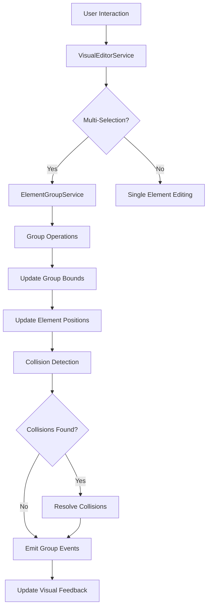

# Element Grouping System Design

## Overview
This design implements a comprehensive element grouping system for the enhanced visual editing framework, enabling users to create, manage, and manipulate groups of elements as single units.

## Architecture

### Core Components

#### 1. Interfaces and Types
```typescript
// Element Group Definition
interface ElementGroup {
  id: string;
  name: string;
  elements: GroupElement[];
  bounds: GroupBounds;
  config: GroupConfig;
  createdAt: number;
  sectionId: string;
}

interface GroupElement {
  elementId: string;
  element: HTMLElement;
  relativePosition: { x: number; y: number };
  originalBounds: EnhancedElementBounds;
}

interface GroupBounds {
  x: number;
  y: number;
  width: number;
  height: number;
  centerX: number;
  centerY: number;
}

interface GroupConfig {
  enableDrag: boolean;
  enableResize: boolean;
  maintainAspectRatio: boolean;
  proportionalScaling: boolean;
  collisionDetection: boolean;
  snapToGrid: number;
  minWidth: number;
  minHeight: number;
  maxWidth?: number;
  maxHeight?: number;
}

// Group Operations
type GroupOperation =
  | 'create'
  | 'addElement'
  | 'removeElement'
  | 'delete'
  | 'move'
  | 'resize'
  | 'transform';

interface GroupEvent {
  type: GroupOperation;
  groupId: string;
  elementIds?: string[];
  bounds?: GroupBounds;
  timestamp: number;
}
```

#### 2. ElementGroupService
Central service for managing all group operations:

```typescript
@Injectable({ providedIn: 'root' })
export class ElementGroupService {
  // Group Management
  createGroup(elements: HTMLElement[], config?: Partial<GroupConfig>): ElementGroup;
  deleteGroup(groupId: string): void;
  addToGroup(groupId: string, elements: HTMLElement[]): void;
  removeFromGroup(groupId: string, elementIds: string[]): void;

  // Group Operations
  moveGroup(groupId: string, deltaX: number, deltaY: number): void;
  resizeGroup(groupId: string, newBounds: GroupBounds, maintainAspectRatio?: boolean): void;
  transformGroup(groupId: string, transformation: GroupTransformation): void;

  // Collision Detection
  checkGroupCollisions(groupId: string): CollisionResult[];
  resolveGroupCollisions(groupId: string, collisions: CollisionResult[]): void;

  // State Management
  getGroup(groupId: string): ElementGroup | undefined;
  getAllGroups(): ElementGroup[];
  getGroupsInSection(sectionId: string): ElementGroup[];
  saveGroupState(groupId: string): void;
  restoreGroupState(groupId: string): void;
}
```

#### 3. ElementGroupDirective
Directive for group-level visual editing:

```typescript
@Directive({
  selector: '[elementGroup]',
  standalone: true
})
export class ElementGroupDirective implements OnInit, OnDestroy {
  @Input() elementGroup!: ElementGroup;
  @Output() groupEvents = new EventEmitter<GroupEvent>();

  // Group editing functionality
  private setupGroupEditing(): void;
  private createGroupOverlay(): void;
  private setupGroupDrag(): void;
  private setupGroupResize(): void;
}
```

#### 4. Enhanced Multi-Selection Support
Extend VisualEditorService with multi-selection capabilities:

```typescript
export class VisualEditorService {
  // Multi-selection state
  private selectedElements = new Set<HTMLElement>();
  private activeGroup: ElementGroup | null = null;

  // Multi-selection methods
  selectMultiple(elements: HTMLElement[]): void;
  addToSelection(element: HTMLElement): void;
  removeFromSelection(element: HTMLElement): void;
  clearSelection(): void;

  // Group integration
  createGroupFromSelection(): ElementGroup;
  selectGroup(groupId: string): void;
}
```

## Features

### 1. Group Creation and Management
- **Multi-selection**: Click and drag to select multiple elements, or Ctrl+click to add/remove individual elements
- **Group creation**: Ctrl+G to group selected elements
- **Group naming**: Auto-generated names or user-defined
- **Nested groups**: Support for groups within groups (future enhancement)

### 2. Group-Level Transformations
- **Unified drag**: Move entire group while maintaining relative positions
- **Proportional resize**: Scale all elements proportionally
- **Aspect ratio locking**: Maintain group aspect ratio during resize
- **Grid snapping**: Snap group movements to grid

### 3. Collision Detection
- **Inter-group collisions**: Detect when groups overlap
- **Boundary enforcement**: Prevent groups from moving outside containers
- **Smart collision resolution**: Auto-adjust positions to resolve conflicts
- **Collision feedback**: Visual indicators for collision states

### 4. Visual Feedback
- **Group overlay**: Semi-transparent overlay showing group bounds
- **Group handles**: Resize handles for the entire group
- **Element highlighting**: Highlighted borders for grouped elements
- **Group labels**: Display group names and dimensions
- **Selection indicators**: Different visual states for selected vs grouped elements

### 5. Keyboard Shortcuts
- `Ctrl+G`: Group selected elements
- `Ctrl+Shift+G`: Ungroup selected group
- `Ctrl+A`: Select all elements in current section
- `Escape`: Clear selection
- `Delete`: Delete selected elements/groups

## Integration with Existing System

### EnhancedVisualEditableDirective Updates
```typescript
export class EnhancedVisualEditableDirective {
  // Add group support
  @Input() groupId?: string;
  @Input() isGroupMember = false;

  // Group integration methods
  joinGroup(groupId: string): void;
  leaveGroup(): void;
  getGroupRelativePosition(): { x: number; y: number };
}
```

### Backward Compatibility
- Existing single-element editing continues to work unchanged
- Group operations are opt-in via configuration
- No breaking changes to existing APIs

## Implementation Plan

### Phase 1: Core Infrastructure
1. Define group interfaces and types
2. Create ElementGroupService skeleton
3. Extend VisualEditorService for multi-selection

### Phase 2: Group Operations
1. Implement group creation and management
2. Add group-level drag functionality
3. Implement proportional scaling

### Phase 3: Advanced Features
1. Collision detection system
2. Group overlay and visual feedback
3. Keyboard shortcuts integration

### Phase 4: Integration and Testing
1. Update EnhancedVisualEditableDirective
2. Integration testing with existing components
3. Performance optimization
4. Documentation and examples

## Data Flow



## Error Handling and Edge Cases

### Error Scenarios
- Attempting to group elements from different sections
- Deleting elements that belong to groups
- Concurrent modifications to the same group
- Network failures during state synchronization

### Recovery Mechanisms
- Automatic group recreation on element restoration
- State validation and cleanup
- Graceful degradation when services are unavailable

## Performance Considerations

### Optimization Strategies
- **Lazy loading**: Only load group data when needed
- **Efficient updates**: Batch DOM updates during group operations
- **Memory management**: Clean up unused group references
- **Debounced operations**: Prevent excessive updates during rapid interactions

### Metrics to Monitor
- Group operation response time
- Memory usage during complex group manipulations
- Collision detection performance
- Visual feedback rendering performance

## Testing Strategy

### Unit Tests
- ElementGroupService operations
- Collision detection algorithms
- Group transformation calculations
- Visual feedback components

### Integration Tests
- Multi-selection workflows
- Group creation and deletion
- Cross-component group operations
- Keyboard shortcut handling

### E2E Tests
- Complete group manipulation workflows
- Performance under load
- Error recovery scenarios

## Future Enhancements

### Potential Features
- **Nested groups**: Groups containing other groups
- **Group templates**: Save and reuse group configurations
- **Collaborative editing**: Real-time group synchronization
- **Advanced transformations**: Rotation, skewing, perspective
- **Group animations**: Smooth transitions for group operations
- **Smart grouping**: AI-assisted element grouping suggestions

This design provides a solid foundation for element grouping while maintaining extensibility for future enhancements.