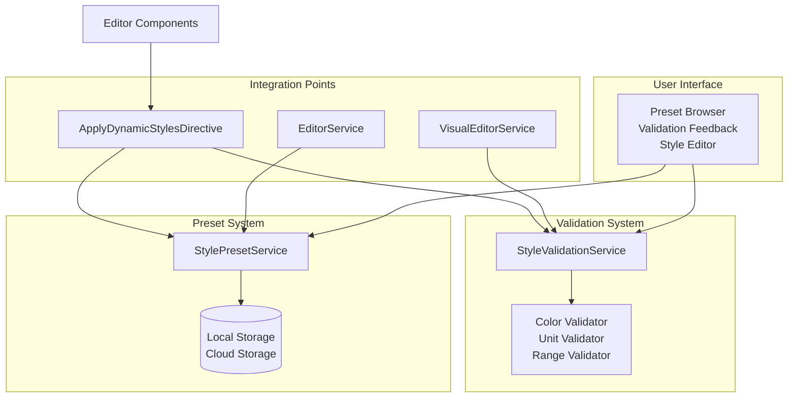

# Style Validation and Preset System Design Plan

## Overview
This document outlines the design and implementation plan for a comprehensive style validation and preset system for the enhanced visual editing framework. The system will provide robust validation of style properties, manage reusable style presets, ensure style consistency across components, and offer automatic style corrections.

## Current System Analysis

### Existing Style Infrastructure
- **Style Interfaces**: `ElementStyles` and `SectionStyles` define style properties (color, backgroundColor, fontSize, etc.)
- **Style Application**: `ApplyDynamicStylesDirective` applies styles by converting camelCase to kebab-case CSS properties
- **CSS Variable Mapping**: Automatic mapping of certain properties to theme variables (--theme-bg, --theme-color, etc.)
- **Visual Editing**: `VisualEditorService` handles drag/resize but not style validation

### Gaps Identified
- No validation of style property values (invalid colors, units, ranges)
- No preset system for reusable style combinations
- No automatic correction of invalid styles
- No consistency checking across components
- Limited feedback for style-related errors

## System Architecture

### Architecture Diagram


### Core Services

#### 1. StyleValidationService
**Purpose**: Validates individual style properties and complete style objects

**Key Features**:
- Color format validation (hex, rgb, hsl, named colors)
- CSS unit validation (px, %, em, rem, vh, vw)
- Property range validation (opacity 0-1, font-size min/max)
- Custom validation rules per component type
- Validation result reporting with severity levels

**Methods**:
```typescript
validateProperty(property: string, value: any): ValidationResult
validateStyles(styles: ElementStyles | SectionStyles): ValidationReport
getSuggestions(invalidValue: any, property: string): CorrectionSuggestion[]
```

#### 2. StylePresetService
**Purpose**: Manages reusable style presets and themes

**Key Features**:
- CRUD operations for presets
- Preset categorization (buttons, cards, sections, themes)
- Preset inheritance and composition
- Preset versioning and metadata
- Import/export functionality

**Methods**:
```typescript
createPreset(preset: StylePreset): Observable<StylePreset>
getPresets(category?: string): Observable<StylePreset[]>
applyPreset(elementId: string, presetId: string): Observable<void>
getPresetById(id: string): Observable<StylePreset>
```

### Data Models

#### StyleValidationResult
```typescript
interface StyleValidationResult {
  property: string;
  value: any;
  isValid: boolean;
  severity: 'error' | 'warning' | 'info';
  message: string;
  suggestions?: CorrectionSuggestion[];
}
```

#### StylePreset
```typescript
interface StylePreset {
  id: string;
  name: string;
  description: string;
  category: 'button' | 'card' | 'section' | 'theme' | 'typography' | 'layout';
  styles: ElementStyles | SectionStyles;
  tags: string[];
  createdAt: Date;
  updatedAt: Date;
  author: string;
  usage: number; // Track usage frequency
}
```

#### CorrectionSuggestion
```typescript
interface CorrectionSuggestion {
  value: any;
  description: string;
  confidence: number; // 0-1, how likely this correction is correct
  autoApply?: boolean; // Whether to apply automatically
}
```

### Integration Points

#### Enhanced ApplyDynamicStylesDirective
- Intercept style application
- Validate styles before applying
- Apply corrections automatically or show warnings
- Emit validation events for UI feedback

#### Editor Services Integration
- Extend `EditorService` with preset management
- Integrate validation into `VisualEditorService`
- Add preset selection to editor UI

#### Component Consistency
- Global style consistency checker
- Component-specific style rules
- Theme inheritance validation

## Implementation Phases

### Phase 1: Core Validation Service
1. Create `StyleValidationService` with basic property validators
2. Implement color, unit, and range validation
3. Add validation result interfaces
4. Create unit tests for validation logic

### Phase 2: Preset Management Service
1. Design `StylePreset` interface and storage
2. Implement CRUD operations in `StylePresetService`
3. Add preset categorization and search
4. Create preset import/export functionality

### Phase 3: Auto-Correction System
1. Implement correction suggestion algorithms
2. Add configurable correction strategies
3. Create correction application logic
4. Add user preference system for auto-corrections

### Phase 4: Integration and UI
1. Enhance `ApplyDynamicStylesDirective` with validation
2. Integrate presets into editor components
3. Add validation feedback UI components
4. Create preset selection interface

### Phase 5: Consistency and Advanced Features
1. Implement style consistency checking
2. Add theme inheritance validation
3. Create bulk style operations
4. Add analytics for style usage patterns

## Validation Rules

### Color Validation
- Hex: #RGB, #RRGGBB, #RRGGBBAA
- RGB/RGBA: rgb(r, g, b), rgba(r, g, b, a)
- HSL/HSLA: hsl(h, s%, l%), hsla(h, s%, l%, a)
- Named colors: CSS color names
- Auto-correction: Convert invalid formats to valid ones

### Unit Validation
- Length: px, em, rem, vh, vw, vmin, vmax, %
- Time: s, ms
- Angle: deg, rad, grad, turn
- Auto-correction: Convert between compatible units

### Property-Specific Rules
- Opacity: 0-1 range
- Font-size: Min 8px, max reasonable limits
- Border-radius: Non-negative values
- Z-index: Integer values

## Preset Categories

### Component Presets
- **Buttons**: Primary, secondary, outline, ghost variants
- **Cards**: Default, elevated, outlined, filled
- **Typography**: Headings, body text, captions
- **Forms**: Input styles, label styles

### Section Presets
- **Hero**: Full-width, centered, gradient backgrounds
- **Features**: Grid layouts, card-based
- **Testimonials**: Carousel, grid, list layouts

### Theme Presets
- **Color Schemes**: Light, dark, high-contrast
- **Brand Themes**: Company-specific color palettes
- **Seasonal Themes**: Holiday-specific styling

## User Experience Considerations

### Validation Feedback
- Real-time validation as styles are edited
- Clear error messages with actionable suggestions
- Visual indicators for invalid styles
- Option to ignore warnings

### Preset Management
- Visual preset browser with previews
- Drag-and-drop preset application
- Preset creation from existing styles
- Preset sharing and import/export

### Auto-Correction Behavior
- Configurable auto-correction preferences
- Preview of corrections before application
- Undo functionality for corrections
- Learning from user preferences

## Technical Considerations

### Performance
- Lazy validation to avoid blocking UI
- Caching of validation results
- Debounced validation for real-time editing

### Extensibility
- Plugin system for custom validators
- Custom preset categories
- Third-party preset marketplaces

### Data Storage
- Local storage for user presets
- Cloud sync for team presets
- Version control for preset changes

## Testing Strategy

### Unit Tests
- Individual validator functions
- Preset CRUD operations
- Correction algorithms
- Integration with directives

### Integration Tests
- End-to-end style application
- Preset application workflows
- Validation feedback loops

### User Acceptance Testing
- Real-world style editing scenarios
- Performance with large style objects
- Accessibility of validation feedback

## Success Metrics

### Technical Metrics
- Validation accuracy > 95%
- Auto-correction acceptance rate > 80%
- Preset application time < 100ms

### User Experience Metrics
- Reduction in invalid style errors
- Increase in preset usage
- User satisfaction with auto-corrections

## Migration Plan

### Backward Compatibility
- Existing styles continue to work
- Validation is opt-in initially
- Gradual rollout of strict validation

### Data Migration
- Convert existing style collections to presets
- Validate historical style data
- Clean up invalid styles

## Future Enhancements

### Advanced Features
- AI-powered style suggestions
- Style trend analysis
- Collaborative style libraries
- Style accessibility validation

### Integration Opportunities
- Design system synchronization
- Figma/Adobe XD import
- Style guide generation

This plan provides a comprehensive foundation for implementing a robust style validation and preset system that enhances the visual editing experience while maintaining flexibility and performance.